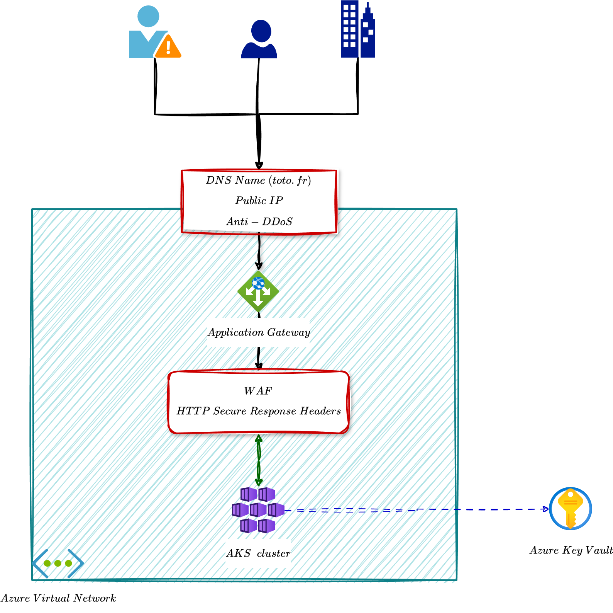

# Documentation on the custom Azure PaaS

## Architecture

The following documentation comprehensively explains the necessary resources and dependencies for setting up a private AKS (Azure Kubernetes Service) cluster. This deployment follows the best practices for an AKS private cluster. It involves an architecture design with components such as DDoS protection, public IPv4 address, application gateway, Azure Key Vault, and more.

Please note that the steps here offer a high-level overview of the process. To understand the deployment completely, reviewing the provided architecture design image is highly recommended.

## Components of the PaaS

- **Azure Resource Group**: It is a powerful and flexible tool that serves as the primary container for all resources. A single resource group, such as resource-group-test, can contain multiple clusters, such as cluster-1, cluster-2, and cluster-3, allowing you to manage your resources as you see fit.
- **Azure Virtual Network**: a high-performance network that provides an isolated environment for the deployed resources. It contains subnets for the Kubernetes cluster and the application gateway, ensuring efficient and reliable network operations.
- **Azure Kubernetes Service (AKS) Cluster**: A fully managed Kubernetes cluster runs on Azure. It consists of a control plane and a set of private worker nodes, which are the machines that run the containers.
- **Application Gateway**: This is a web traffic (OSI layer 7) load balancer that can make routing decisions based on additional attributes of an HTTP request, such as URI path or host headers.
- **Azure Key Vault**: A robust cloud service for securely storing and accessing secrets. It supports two types of containers: vaults and managed hardware security module(HSM) pools, ensuring the highest level of security for your secrets.

## Advantages

- Prevention against accidental deletion via Azure Lock, a feature that allows you to lock critical Azure resources to prevent accidental modification or deletion, thereby ensuring the integrity of your resources.
- Protection against Layer 7 Distributed Denial of Service (DDoS) attacks using Web Application Firewall (WAF), which helps defend against targeted and sophisticated attacks on web applications.
- Blocking of malicious IP addresses and ranges to prevent unauthorized access and malicious activities.
- Prevention of security vulnerabilities with HTTP Secure Headers, which helps in securing web applications by implementing best practices for HTTP security headers.
- Data encryption in transit ensures that data is securely transmitted over the network, protecting it from unauthorized access during transmission.
- Data encryption at rest of nodes' disks and persistent volume claims provides an additional layer of security by encrypting data stored on servers and persistent storage.

## Tutorials:

### Deploy a custom Azure PaaS

1. Create a storage for the TF state files

{width=75%}

2. Create the Kubernetes cluster and its addons

{width=75%}

### Test the custom Azure PaaS

1. Deploy a two-tier application on the Kubernetes cluster

{width=75%}

2. Visualize the resources via Azure portal

{width=75%}

## Additional resources

[Click here to see other videos tutorials](./media/)